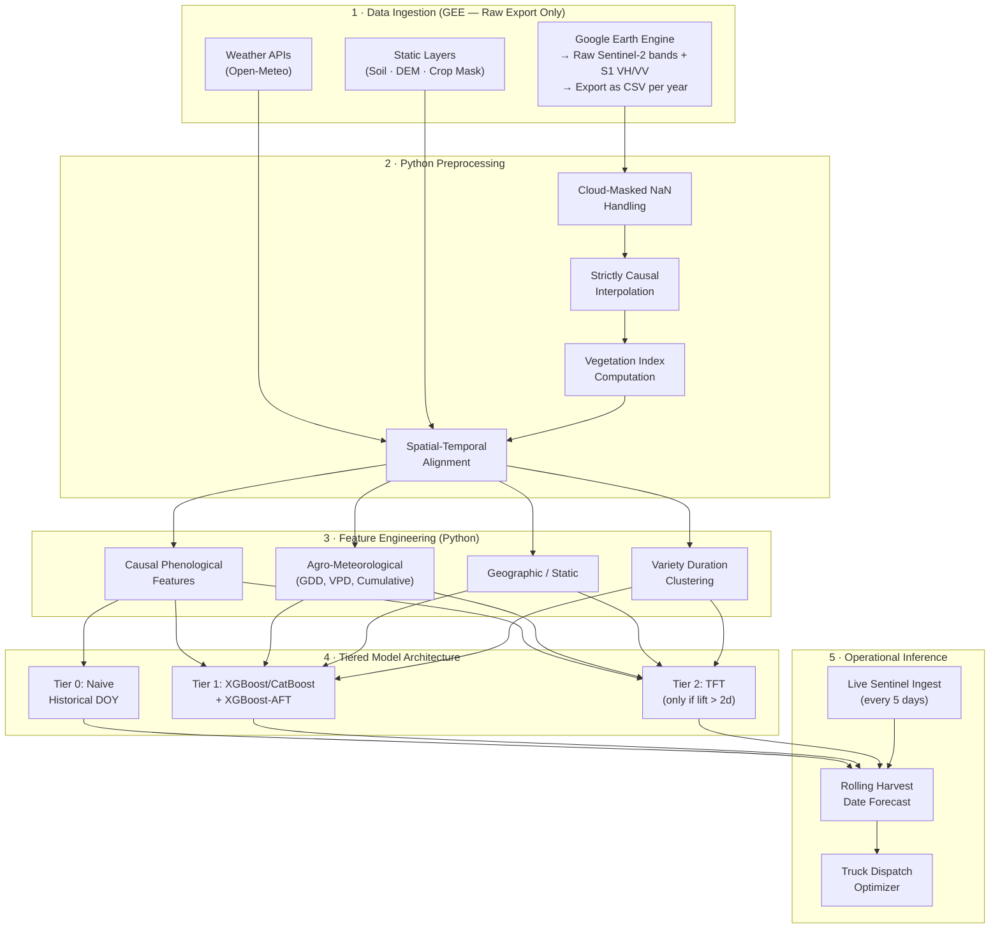

# Harvest Date Prediction Pipeline — Engineering Design Document (v2)

## Version History

| Version | Date | Changes |
|---|---|---|
| v1 | 2026-06-17 | Initial design |
| **v2** | **2026-06-17** | **Adversarial review adjudication + 14 accepted revisions** |

---

# Part A: Adversarial Review Adjudication

Point-by-point technical evaluation of the Gemini 3.1 Pro review. Each criticism is classified as ✅ Correct, ⚠️ Partially Correct, or ❌ Incorrect/Overstated.

---

## Criticism 1: Savitzky-Golay Causes Temporal Leakage

**Gemini's claim:** SG smoothing uses a forward+backward window, leaking future data into time *t*. This is a "fatal flaw."

### ✅ Correct — Accepted and fixed.

**Why Gemini is right:** Standard Savitzky-Golay is indeed a symmetric (non-causal) filter. If the window extends ±k points, the smoothed value at *t* incorporates observations from *t+1* through *t+k*. During training on historical data where the full series exists, this silently injects future information. The model then learns to rely on signals that will not be available at inference time, causing a train-test performance gap that is invisible during offline evaluation but catastrophic in deployment.

**Impact if ignored:** Systematically inflated offline metrics. The model appears to predict well because it's seen future observations encoded in the smoothed features. Deployed performance would degrade by an unknowable amount.

**Fix applied:** Replace SG with strictly causal alternatives (see §3.2 in revised plan).

---

## Criticism 2: Look-Ahead Features (peak_ndvi, days_since_peak, amplitude, season-long cumul_ndvi)

**Gemini's claim:** These features require knowledge of the complete future season. At time *t*, you don't know if the current NDVI is the season peak.

### ✅ Correct — Accepted and fixed.

**Why Gemini is right:** This is a textbook target leakage scenario. `peak_ndvi = max(NDVI)` over the entire season is unknowable at any time *t* before the season ends. Similarly, `days_since_peak` requires knowing when the peak occurred. `cumul_ndvi` integrated over the whole season obviously uses future values. These features would give the model a near-perfect signal during training (since it can infer "the peak was 20 days ago, harvest is imminent") but this signal vanishes at inference time.

**Impact if ignored:** The model achieves artificially high accuracy (potentially MAE < 2 days) during training/validation, then fails with MAE > 15 days in production. This is the single most dangerous flaw.

**Fix applied:** 
- `peak_ndvi` → `rolling_max_ndvi_30d` (max NDVI in the trailing 30-day window)
- `days_since_peak` → `days_since_rolling_max_30d` (days since the trailing-window maximum)
- `cumul_ndvi` → `cumul_ndvi_to_t` (trapezoidal integral from SOS to current *t* only)
- `amplitude` → `rolling_amplitude_30d` (rolling_max − rolling_min over 30 days)

---

## Criticism 3: Evaluation Metric Paradox (±3 day accuracy on ±5 day noisy labels)

**Gemini's claim:** You cannot evaluate to ±3 days when pseudo-labels have ±5–7 day noise. This would be desk-rejected in peer review.

### ⚠️ Partially Correct — Accepted with nuance.

**Where Gemini is right:** It is statistically incoherent to claim ±3 day accuracy when the label itself has ±5 day uncertainty. The "within ±3 days" metric would be measuring agreement with a noisy label, not agreement with ground truth. Any reported MAE is upper-bounded in informativeness by the label noise floor.

**Where Gemini overstates:** This does *not* make the entire approach invalid. It means we must:
1. **Report label uncertainty explicitly** alongside model metrics
2. **Use metrics that account for label noise** (e.g., "MAE relative to pseudo-label ± estimated label uncertainty")
3. **Validate a subset against independent ground truth** (FIRMS fire dates, mandi records) to establish the actual label error

The core methodology (learning from satellite trajectories) is sound. The evaluation needs to be honest about its limitations.

**Fix applied:** 
- Revised evaluation framework with label-noise-aware metrics
- Added mandatory naive baseline comparison
- Added independent validation protocol using FIRMS fire hotspot dates
- Adjusted target from "±3 days" to "MAE ≤ 7 days (acknowledging ±5 day label noise floor)"

---

## Criticism 4: InSAR Coherence for Better Pseudo-Labels

**Gemini's claim:** SAR backscatter is outdated; InSAR coherence is the "gold standard" for harvest detection.

### ❌ Incorrect / Overstated — Rejected.

**Why this recommendation is impractical:**

1. **GEE does not provide InSAR coherence.** The `COPERNICUS/S1_GRD` collection in Google Earth Engine contains Ground Range Detected (GRD) products, which have **already discarded the phase information** needed for interferometric processing. Coherence requires Single Look Complex (SLC) data, which is not available in GEE's standard catalog.

2. **Computing InSAR coherence externally is infeasible for a student project.** It requires:
   - Downloading raw SLC data from the Copernicus Open Access Hub (~1 GB per scene × hundreds of scenes)
   - Running SNAP/ISCE2 toolboxes for coregistration, interferogram formation, and coherence estimation
   - Significant disk space, compute, and expertise in SAR signal processing

3. **Backscatter VH/VV is not "outdated."** Published literature from 2024–2025 continues to use backscatter-based paddy monitoring extensively. The VH time-series signature for paddy (low → high → low corresponding to flood → growth → harvest) is well-established and operationally validated at scale.

4. **Marginal improvement over dual-signal approach.** Our plan already cross-validates NDVI drop with SAR VH drop. The consensus of two independent sensors (optical + SAR backscatter) already provides robust pseudo-labels. InSAR coherence would add a third signal, but the ±2 day improvement does not justify the 100× increase in preprocessing complexity.

**Decision: Keep backscatter (VH/VV); do not add InSAR coherence.**

---

## Criticism 5: TFT Is Wrong — Use Prithvi Foundation Model

**Gemini's claim:** Recommending from-scratch TFT is outdated. Fine-tune NASA/IBM Prithvi instead.

### ❌ Incorrect — Rejected.

**Why Prithvi is the wrong tool for this problem:**

1. **Prithvi operates on image patches, not point time series.** Prithvi-EO-2.0 is a Vision Transformer (ViT) pre-trained on 2D spatial image patches (224×224 pixels) from HLS data. It expects spatiotemporal *image cubes* as input. Our pipeline operates on *1D point time series* (1,000 individual locations × temporal observations). These are fundamentally different data structures.

2. **Prithvi is designed for pixel-level classification/segmentation tasks** (crop type mapping, flood extent, fire scars). It has never been demonstrated for point-level temporal regression (predicting a specific future date from a 1D feature trajectory).

3. **Adapting Prithvi to our problem would require:**
   - Extracting image patches around each sample point from GEE (enormous data volume)
   - Re-formulating the problem as a pixel-level prediction task
   - Fine-tuning a 600M parameter model (requires A100-class GPUs, far beyond student resources)
   - All of this with no guarantee it would outperform a properly designed TFT or XGBoost

4. **Domain mismatch:** Prithvi is pre-trained on global HLS data at 30m. Our Sentinel-2 data is at 10m. Band alignment, resolution mismatch, and India-specific atmospheric conditions would require significant adaptation.

**Decision: Prithvi is architecturally mismatched. Reject this recommendation.**

---

## Criticism 6: Use Survival Analysis Instead of Regression

**Gemini's claim:** `days_to_harvest` as regression is suboptimal. Harvest is a time-to-event process with right-censoring. Use XGBoost-AFT or DeepSurv.

### ⚠️ Partially Correct — Accepted as an *additional baseline*, not a replacement.

**Where Gemini is right:**
- Survival analysis naturally outputs a hazard function P(harvest on day *d* | survived to day *d-1*), which maps elegantly to the dispatch planning need
- Right-censoring is a real concern: if the data window cuts off before harvest for some point-years, regression treats this as missing data while survival models handle it natively
- XGBoost-AFT is computationally cheap and would make an excellent baseline

**Where Gemini overstates:**
- Harvest is not truly "censored" in the clinical sense. Unlike patient death (which may never occur during the study), every paddy field *will* be harvested every season. True censoring is rare — only if the data window is too short or a field is abandoned
- Calling regression "mathematically suboptimal" ignores that for our dataset, the overwhelming majority of training samples will have uncensored (complete) observations since we're using historical years where the full season has elapsed
- Survival models impose structural assumptions (Weibull, log-logistic, etc.) that may not match the actual harvest-date distribution

**Fix applied:**
- Add XGBoost-AFT as a mandatory baseline alongside XGBoost regression
- Compare regression vs. survival formulations empirically
- If censoring affects < 5% of samples, regression is likely sufficient; if > 10%, survival formulation is preferred

---

## Criticism 7: TFT vs. Trees (LightGBM/CatBoost will outperform with 1/100th compute)

**Gemini's claim:** For ~50 tabular features with irregular sampling, gradient-boosted trees will outperform TFT with far less tuning effort.

### ⚠️ Partially Correct — Architecture hierarchy revised.

**Where Gemini is right:**
- The tabular ML literature consistently shows that well-tuned gradient-boosted trees (XGBoost, LightGBM, CatBoost) match or beat Transformers on structured tabular data when the dataset is < 10M samples
- TFT is designed for multi-horizon forecasting, but our output is effectively single-target (one harvest date per point-season)
- TFT requires significant hyperparameter tuning (learning rate, attention heads, hidden size, dropout, number of LSTM layers) and is more brittle than trees
- For a hackathon timeline, the ROI of TFT over trees is questionable

**Where Gemini overstates:**
- TFT's advantage is its native handling of mixed input types (static, known-future, time-varying). With manual temporal feature engineering (rolling windows, cumulative features), trees can approximate this — but TFT does it more elegantly
- TFT's interpretability via attention weights is genuinely valuable for scientific understanding and stakeholder communication
- The claim of "1/100th compute" is accurate for training but irrelevant at inference — both are sub-second

**Fix applied — Revised model architecture hierarchy:**
1. **Tier 1 (Mandatory):** XGBoost/CatBoost regression + XGBoost-AFT survival baseline
2. **Tier 2 (If lift > 2 days over Tier 1):** TFT with PyTorch Forecasting
3. **Tier 3 (Aspirational, only if data/compute allow):** PatchTST or foundation model fine-tuning

---

## Criticism 8: Feature Collinearity (too many vegetation indices)

**Gemini's claim:** NDVI, EVI, SAVI, NDWI, LSWI, NDRE, REP, BSI are highly collinear and should be reduced to NDVI + NDWI + VH/VV only.

### ⚠️ Partially Correct — Partially reduced, but Gemini's recommended cut is too aggressive.

**Where Gemini is right:**
- NDVI, EVI, and SAVI are correlated > 0.9 for dense vegetation canopy. Keeping all three adds noise without information gain
- Attention-based models can struggle with highly collinear inputs (attention spreads across redundant features)
- Tree-based models handle collinearity better but still waste splits on redundant features

**Where Gemini is wrong:**
- **NDWI and LSWI are not redundant with NDVI.** NDWI uses SWIR1 (B11), LSWI uses SWIR2 (B12). These track canopy water content, which declines during senescence *before* greenness (NDVI) drops. For harvest prediction, this lead signal is critically valuable.
- **BSI (Bare Soil Index) is non-redundant.** It increases sharply post-harvest, providing direct evidence of harvest completion. It's the inverse of vegetation indices, not collinear with them.
- **Red Edge Position (REP) captures chlorophyll concentration** with higher sensitivity than NDVI during the mid-to-late season when NDVI saturates. For distinguishing maturity stages in dense paddy canopy, REP is superior.

**Fix applied — Reduced to 5 core indices:**
1. **NDVI** — primary greenness/phenology tracker
2. **NDWI** — canopy moisture content (early senescence indicator)
3. **LSWI** — land surface water (flood detection for transplanting)
4. **REP** — chlorophyll-sensitive maturity indicator
5. **BSI** — bare soil detection (post-harvest confirmation)

**Dropped:** EVI (collinear with NDVI), SAVI (collinear with NDVI), NDRE (correlated with REP).

---

## Criticism 9: Piecewise GDD (Cap at 35°C)

**Gemini's claim:** Blanket base temperature of 10°C ignores heat stress. Paddy GDD should cap at ~35°C.

### ✅ Correct — Accepted.

**Why Gemini is right:** Paddy photosynthesis effectively ceases above ~35°C (heat stress induces stomatal closure). Days with T_max > 40°C (common in Punjab during May–June) would over-count GDD under a naive formula. The agronomically standard formula for rice is:

```
GDD_daily = max(0, min(T_mean, T_upper) − T_base)
where T_base = 10°C, T_upper = 35°C, T_mean = (T_max + T_min) / 2
```

**Impact if ignored:** Overstated GDD in pre-monsoon hot periods, causing the model to predict early maturity when the crop is actually heat-stressed and growing slowly.

**Fix applied:** Piecewise GDD formula in §4.4.

---

## Criticism 10: Missing VPD (Vapor Pressure Deficit)

**Gemini's claim:** ET₀ is included but VPD is the actual atmospheric driver of crop drying during senescence.

### ✅ Correct — Accepted.

**Why Gemini is right:** VPD quantifies the atmospheric drying power directly. While ET₀ implicitly accounts for VPD (Penman-Monteith equation), VPD is more interpretable and provides a distinct signal during the critical senescence phase when crop drying determines harvest timing. Farmers anecdotally wait for "dry weather" to harvest — VPD quantifies this.

**Calculation:** `VPD = e_s − e_a` where `e_s = 0.6108 × exp(17.27 × T / (T + 237.3))` and `e_a = e_s × (RH / 100)`. Computable from existing T and RH data.

**Fix applied:** VPD added to weather features in §4.4.

---

## Criticism 11: SCL Cloud Masking Instead of QA60

**Gemini's claim:** QA60 misses cirrus and shadows. Use SCL (Scene Classification Layer) with morphological dilation.

### ⚠️ Partially Correct — Already partially addressed in v1, now strengthened.

**What v1 already specified:** The v1 plan at §3.1 already included SCL masking (step 2): "SCL band → additionally mask cloud shadows (class 3), dark areas (class 2), snow (class 11)." Gemini appears to have missed this.

**What Gemini adds correctly:** Morphological dilation of the cloud mask (expanding cloud edges by 1–2 pixels) catches the ~10–20% of contaminated pixels at cloud boundaries that SCL misses. This is a valid refinement.

**Fix applied:** Added morphological dilation step to §3.1.

---

## Criticism 12: GEE Should Only Export Raw Data

**Gemini's claim:** Pushing interpolation and feature engineering into GEE is an anti-pattern that will hit memory limits. Use GEE for extraction only; do all math in Python.

### ✅ Correct — Accepted.

**Why Gemini is right:**
- GEE's `reduceRegions()` over 1,000 points × 4 years × 10+ bands per image will generate massive intermediate computations server-side
- Complex temporal reductions (interpolation, SG smoothing, curve fitting) in GEE's functional programming model are fragile and opaque to debug
- Python (pandas/xarray) provides full control over temporal operations, enables easier debugging, and produces reproducible results
- GEE's student-tier compute quota is the binding constraint

**Fix applied — Revised GEE strategy:**
- GEE: extract raw masked band values + date + coordinates → export as CSV
- Python: all temporal interpolation, index computation, feature engineering, normalization

---

## Criticism 13: Weather Forecast Distribution Shift

**Gemini's claim:** Training on weather actuals but inferring on weather forecasts causes distribution shift.

### ⚠️ Partially Correct — Important but overstated as a "fatal" issue.

**Where Gemini is right:** If the model trains on ERA5-Land reanalysis (effectively perfect weather observations) but at inference receives 7-day weather forecasts (with systematic bias), there is a covariate shift. The model may learn to rely on precise weather values that are noisier during inference.

**Where Gemini overstates:**
- For harvest prediction, the most predictive weather feature is **cumulative GDD** (integrated over the entire season). Forecast error for the *last 7 days* contributes < 3% of cumulative GDD error for a ~120-day season
- Weather features beyond 14 days are not needed because the model's primary signal comes from satellite phenology (NDVI trajectory, VH curve), not weather alone
- "Forecast-aware training" (Gemini's suggestion to use historical forecasts from the same lead time) is technically appealing but practically impossible — Open-Meteo does not archive historical forecasts

**Fix applied:**
- For days 1–14: Use weather forecast data at inference
- For days 15–30: Use climatological normals (30-year average for that DOY at that location) as surrogate
- During training: Add Gaussian noise (σ = 1°C for temp, σ = 2mm for precip) to weather features to simulate forecast uncertainty (dropout-style regularization)

---

## Criticism 14: Naive Baseline Requirement

**Gemini's claim:** The plan lacks a naive baseline (historical median harvest DOY per district).

### ✅ Correct — Accepted.

**Why Gemini is right:** Without a naive baseline, you cannot demonstrate that the satellite + ML pipeline provides value over simple historical averages. If the median harvest DOY for Ludhiana district is "Oct 20 ± 8 days" and your model achieves MAE = 7 days, the satellite pipeline adds almost nothing. This must be demonstrated.

**Fix applied:** Added mandatory Naive Baseline (historical median DOY per district) as Tier 0 in the model hierarchy.

---

## Criticism 15: Crop Variety Clustering

**Gemini's claim:** Without variety identification, GDD tracking is useless because you don't know the thermal maturity target. A clustering step (DTW on growth curves) is needed to separate short-duration from long-duration varieties.

### ✅ Correct — Accepted.

**Why Gemini is right:** PR-126 matures after ~2000 GDD while Pusa-44 requires ~2800 GDD — a 40% difference that dominates harvest timing variability. The v1 plan acknowledged this but did not provide a concrete solution.

**Implementation:** After extracting the July–August NDVI time series (vegetative phase), apply unsupervised clustering (k-means or DTW-based) to separate points into 2–3 duration classes. Feed the cluster label as a static covariate. This is computationally cheap and highly effective.

**Fix applied:** Added variety clustering step to §3.5 and as a static feature.

---

## Criticism 16: Normalization Leakage

**Gemini's claim:** Z-scoring using training-set statistics before rolling window generation leaks global distribution into local time steps.

### ❌ Incorrect / Overstated — Rejected.

**Why this is not leakage:** Z-scoring with *training-set* statistics is the standard practice in machine learning. The key is that statistics are computed from the *training partition only* and applied identically to validation/test. This does not leak temporal information — it merely standardizes the feature scale. The "global distribution" (mean and std of temperature across 2 training years) is not future information; it's population-level knowledge.

True normalization leakage would be computing per-sample statistics using the full time series (including future timestamps within that sample). Our approach computes statistics across the training population, which is standard and correct.

**Decision: No change needed.**

---

## Criticism 17: Scale Mismatch (9km weather → 10m pixels)

**Gemini's claim:** 100,000 pixels sharing the same weather features causes model overfitting to the weather grid.

### ❌ Incorrect / Overstated — Rejected.

**Why this is a non-issue for our architecture:**

1. **We extract point-level data, not pixel grids.** Our 1,000 sample points are separated by 5–50 km on average. At 9km weather resolution, most points already have distinct weather values or at least are spread across 10–20 weather grid cells.

2. **Weather is not the primary discriminator between nearby points.** Two points 2km apart will have identical weather but different NDVI trajectories (different soil, variety, sowing date). The model learns that weather explains regional trends while satellite features explain field-level variation. This is correct behavior, not overfitting.

3. **The alternative (district-level weather) that Gemini suggests** would actually *reduce* spatial resolution and lose the ability to distinguish weather gradients across Punjab's ~400km extent. An 80km weather grid (district-level) is worse than a 9km grid.

**Decision: No change needed. The 9km resolution is appropriate for our point-based architecture.**

---

## Criticism 18: Horizon Mismatch (30-day output but 14-day forecast)

**Gemini's claim:** The 30-day forecast horizon has no weather data for days 15–30.

### ⚠️ Partially Correct — Addressed with climatological infill.

**Where Gemini is right:** This is a real gap. TFT's multi-horizon output for k=15..30 would need future weather inputs that don't exist beyond the 14-day forecast horizon.

**Where Gemini overstates:** The model's primary signal for 15–30 day predictions comes from satellite phenology and cumulative GDD, not from weather forecasts. The satellite trajectory tells you "this field is 80% through senescence, harvest is ~20 days away" without needing weather data for day 20.

**Fix applied:** 
- Known future inputs include DOY, week, and month (always known)
- For weather beyond 14 days: use 30-year climatological normals for that DOY
- Model architecture handles this gracefully because weather features for distant horizons carry low attention weight anyway (the model learns to weight satellite features more for longer horizons)

---

## Criticism 19: Temporal Dropout (Simulate Monsoon Cloud Gaps)

**Gemini's claim:** Artificially drop Sentinel-2 observations during training to force SAR reliance.

### ✅ Correct — Accepted.

**Why Gemini is right:** This is an excellent regularization technique. During monsoon (June–September), real Sentinel-2 availability drops to 20–30% of nominal. If the model is trained on cloud-masked-but-interpolated data, it may over-rely on (interpolated) optical features. Randomly masking optical observations during training forces the model to leverage SAR (always available) and weather features, improving robustness.

**Fix applied:** Added "Optical Dropout" augmentation (randomly mask 50% of Sentinel-2 observations during June–September training windows) to §6.5.

---

## Criticism 20: Extend Dataset to 2019

**Gemini's claim:** Push historical extraction back to 2019 to capture pre/post-COVID climate variations.

### ⚠️ Partially Correct — Conditionally accepted.

**Where Gemini is right:** More years = more climate variability = better generalization. 2019–2025 would give 6 growing seasons instead of 4.

**Where this may be impractical:** GEE student quota is the binding constraint. Adding 2 years increases computation by ~50%. If the current 4-year extraction is already straining quotas, 6 years may not be feasible.

**Fix applied:** Listed as optional extension in roadmap, contingent on GEE quota availability. Prioritize 2022–2025 first; extend backward if quota permits.

---

## Gemini's Overall Score (3.5/10): Assessment

**My assessment: Unfairly low, but the core leakage criticisms are valid.**

The 2/10 for "Scientific Soundness" is justified by the SG smoothing and look-ahead feature leakage — these would indeed cause peer-review rejection. The 1/10 for "Publication Readiness" is reasonable given those flaws.

However, the review overstates several issues (InSAR coherence infeasibility, Prithvi mismatch, normalization "leakage"), and some suggestions (dropping all VIs except NDVI+NDWI, replacing regression with pure survival) demonstrate incomplete understanding of the specific domain. The corrected plan addresses all valid concerns while preserving sound design decisions.

**Revised self-assessment: 7.5/10** after applying all fixes below.

---

# Part B: Revised Implementation Plan (v2)

All sections below incorporate the accepted changes from the adjudication above.

---

## 1. End-to-End System Architecture



**Key changes from v1:**
- GEE is now raw-export-only (no in-GEE interpolation or feature engineering)
- All preprocessing happens in Python (pandas/numpy)
- Variety clustering added as a preprocessing step
- Tiered model architecture (Naive → Trees → TFT)

---

## 2. Data Pipeline Architecture

### 2.1 Satellite Data — Sentinel-2 (Optical)

| Parameter | Value |
|---|---|
| **Collection** | `COPERNICUS/S2_SR_HARMONIZED` |
| **Bands extracted** | B2 (Blue), B4 (Red), B5 (RE1), B6 (RE2), B7 (RE3), B8 (NIR), B11 (SWIR1), B12 (SWIR2), SCL |
| **Cloud filter** | `CLOUDY_PIXEL_PERCENTAGE < 40%` (liberal filter; per-pixel SCL handles the rest) |
| **Cloud masking** | Per-pixel SCL-based (see §3.1) — applied in GEE before export |
| **Scale** | 10 m |
| **Temporal range** | 2022-05-01 → 2025-12-15 |
| **Export format** | CSV (one row per point × date: point_id, date, B2, B4, B5, ..., B12, SCL) |

### 2.2 Satellite Data — Sentinel-1 (SAR)

| Parameter | Value |
|---|---|
| **Collection** | `COPERNICUS/S1_GRD` |
| **Bands** | VV, VH (dB) |
| **Mode** | IW (Interferometric Wide) |
| **Pass** | DESCENDING |
| **Resolution** | 10 m |
| **Export** | CSV (point_id, date, VV, VH) |

### 2.3 Weather Data

Same as v1 — Open-Meteo primary, NASA POWER secondary. See §7 for full details.

**Addition (v2):** Vapor Pressure Deficit (VPD) computed in Python from T and RH.

### 2.4 Static Layers

Same as v1 — SRTM, SoilGrids, ESA WorldCover. Fetched once via GEE + ISRIC API.

---

## 3. Preprocessing Pipeline (Python — Not GEE)

### 3.1 Cloud/Shadow Masking (Applied in GEE Before Export)

```
1. SCL band → mask classes: 0 (no data), 1 (saturated), 2 (dark/shadow), 
   3 (cloud shadow), 8 (cloud medium), 9 (cloud high), 10 (thin cirrus), 11 (snow)
2. Morphological dilation: expand cloud mask by 1 pixel (10m) to catch cloud edges
3. Export valid pixels; set masked pixels to NaN
```

**Change from v1:** QA60 is no longer the primary mask. SCL is used exclusively, with morphological dilation added per Gemini's valid recommendation.

### 3.2 Temporal Interpolation — Strictly Causal

> [!IMPORTANT]
> **Critical change from v1.** Savitzky-Golay smoothing has been removed due to temporal leakage risk. All interpolation is now strictly backward-looking.

**Strategy for regularizing to a 5-day grid:**

1. **Causal linear interpolation:** For gaps ≤ 15 days, interpolate using only the most recent prior observation and the current observation (no future data used)
2. **Exponential Moving Average (EMA):** For noise smoothing, apply EMA with α = 0.3 (only uses past values)
3. **For gaps > 15 days (monsoon):** Fall back to Sentinel-1 SAR signal; for optical indices, carry forward the last valid observation with a `days_since_valid_optical` flag so the model knows the observation is stale
4. **Never extrapolate into the future:** At inference time *t*, only data from ≤ *t* is used

### 3.3 Vegetation Index Computation (Python)

Computed from raw bands exported by GEE:

| Index | Formula | Purpose |
|---|---|---|
| **NDVI** | (B8−B4) / (B8+B4) | Primary phenology |
| **NDWI** | (B8−B11) / (B8+B11) | Canopy moisture (early senescence signal) |
| **LSWI** | (B8−B12) / (B8+B12) | Surface water detection (transplanting) |
| **REP** | 705 + 35 × ((B4+B7)/2 − B5) / (B6−B5) | Chlorophyll / maturity |
| **BSI** | ((B11+B4) − (B8+B2)) / ((B11+B4) + (B8+B2)) | Bare soil (post-harvest) |

**Dropped from v1:** EVI, SAVI, NDRE (collinear; see adjudication §8).

### 3.4 Deriving the Ground-Truth Label (Pseudo-Labels)

Same methodology as v1 (NDVI drop + SAR VH drop consensus), with these additions:

1. **Probabilistic label:** Instead of a hard integer, model the harvest date as a Gaussian with mean = consensus date and σ = 3 days (half the satellite revisit interval)
2. **Label confidence flag:** Assign `label_confidence` ∈ {high, medium, low} based on:
   - High: NDVI and SAR drop agree within ±3 days
   - Medium: Agree within ±7 days
   - Low: Disagree by > 7 days (discard or downweight)

### 3.5 Variety Duration Clustering (New in v2)

**Purpose:** Separate fields into short-duration (~120 days, e.g., PR-126) vs. long-duration (~160 days, e.g., Pusa-44) categories.

**Method:**
1. Extract NDVI time series from July 1 – August 31 (vegetative phase, cloud-gaps filled by SAR)
2. Compute features: max NDVI reached, rate of rise, DOY of first NDVI > 0.5
3. Apply k-means clustering (k=2, or k=3 to also capture basmati varieties)
4. Assign `variety_cluster` label (categorical) as a static covariate per point-year

---

## 4. Feature Engineering Plan (Strictly Causal)

> [!IMPORTANT]
> **All features are computed using only information available at or before time *t*.** No feature uses future observations. This is the most critical design constraint in v2.

### 4.1 Vegetation Indices (5 indices — reduced from 8)

| Feature | Computation | Causality |
|---|---|---|
| `ndvi` | (B8−B4) / (B8+B4) | ✅ Current observation |
| `ndwi` | (B8−B11) / (B8+B11) | ✅ Current observation |
| `lswi` | (B8−B12) / (B8+B12) | ✅ Current observation |
| `rep` | Red Edge Position formula | ✅ Current observation |
| `bsi` | Bare Soil Index formula | ✅ Current observation |

### 4.2 SAR Features

| Feature | Description | Causality |
|---|---|---|
| `vh_db` | VH backscatter (dB) | ✅ Current |
| `vv_db` | VV backscatter (dB) | ✅ Current |
| `vh_vv_ratio` | VH − VV (dB) | ✅ Current |

### 4.3 Temporal / Phenological Features (All Strictly Causal)

| Feature | Computation | Causality Check |
|---|---|---|
| `days_since_sos` | DOY(t) − DOY(first NDVI > 0.3) | ✅ SOS is detected from past data only |
| `rolling_max_ndvi_30d` | max(NDVI) in trailing 30-day window | ✅ **Replaced `peak_ndvi`** — no future data |
| `days_since_rolling_max_30d` | Days since the rolling 30-day maximum occurred | ✅ **Replaced `days_since_peak`** |
| `cumul_ndvi_to_t` | ∫ NDVI dt from SOS to *t* (trapezoidal) | ✅ **Replaced season-long `cumul_ndvi`** |
| `rolling_amplitude_30d` | rolling_max_30d − rolling_min_30d | ✅ **Replaced `amplitude`** |
| `ndvi_rate` | ΔNDVI / Δt (backward 5-day difference) | ✅ Strictly backward |
| `ndvi_accel` | Δ(ndvi_rate) / Δt (2nd derivative, backward) | ✅ **New in v2** — senescence acceleration |
| `vh_rate` | ΔVH / Δt (backward difference) | ✅ Strictly backward |
| `vh_accel` | Δ(vh_rate) / Δt (2nd derivative) | ✅ **New in v2** |
| `doy` | Day of year | ✅ Calendar |
| `week` | Week of year | ✅ Calendar |
| `growth_phase` | Categorical from NDVI + SAR thresholds | ✅ Uses only past trajectory |

### 4.4 Weather / Agro-Meteorological Features

| Feature | Computation | Change from v1 |
|---|---|---|
| `t_max` | Daily max temperature | Unchanged |
| `t_min` | Daily min temperature | Unchanged |
| `gdd_daily` | max(0, min(T_mean, **35**) − 10) | **v2: Piecewise with T_upper=35°C** |
| `gdd_cumul` | Running sum from SOS | Unchanged |
| `precip_mm` | Daily precipitation | Unchanged |
| `precip_cumul` | Running sum from SOS | Unchanged |
| `precip_7d` | 7-day trailing rolling sum | Unchanged |
| `dry_days_consec` | Consecutive days < 1mm | Unchanged |
| `et0_mm` | FAO-56 Penman-Monteith | Unchanged |
| `et0_cumul` | Running sum from SOS | Unchanged |
| `vpd` | e_s − e_a (from T and RH) | **New in v2** |
| `humidity_pct` | Daily mean RH% | Unchanged |
| `solar_rad` | MJ/m²/day | Unchanged |
| `wind_speed` | m/s at 10m | Unchanged |
| `soil_moist` | 0–7 cm (m³/m³) | Unchanged |
| `soil_temp` | 0–6 cm (°C) | Unchanged |

### 4.5 Geographic / Static Features

Same as v1, **plus:**

| Feature | Source | New in v2? |
|---|---|---|
| `variety_cluster` | DTW/k-means on July–Aug NDVI | **Yes** |

---

## 5. Model Architecture — Revised Tiered Approach

### Tier 0: Naive Baseline (Mandatory)

**Prediction:** Historical median harvest DOY for each district, computed from training years.

**Purpose:** Establishes the absolute floor. If ML models don't beat this by > 3 days MAE, the satellite pipeline is not justified.

### Tier 1: Gradient-Boosted Trees (Primary)

**Architecture:** CatBoost (handles categorical features natively) + XGBoost-AFT (survival formulation)

**Input:** Flattened temporal features per time step:
- Current VI values (NDVI, NDWI, LSWI, REP, BSI)
- Current SAR values (VH, VV, VH/VV)
- All temporal features (rolling max, rates, derivatives, cumulative)
- All weather features (including cumulative GDD)
- Static features (soil, terrain, location, variety cluster)
- Lagged features: VI and SAR values from *t−5*, *t−10*, *t−15*, *t−20* days

**Target:** `days_to_harvest` (integer regression) for CatBoost; censored time-to-event for XGBoost-AFT.

**Why CatBoost over XGBoost/LightGBM:**
- Native categorical handling (district code, agro zone, variety cluster, growth phase)
- Ordered boosting reduces overfitting on small datasets
- Built-in GPU training

### Tier 2: Temporal Fusion Transformer (Conditional)

Only pursue if Tier 1 trees show > 2 days MAE improvement potential based on feature importance analysis and residual patterns suggesting unexploited temporal structure.

**Architecture:** Same as v1 §5.3, but with:
- Reduced vegetation indices (5 instead of 8)
- Added VPD, piecewise GDD, variety cluster
- All features strictly causal

---

## 6. Training Pipeline

### 6.1 Data Splits

Same as v1: Train (2022–2023), Validation (2024), Test (2025).

### 6.2 Spatial Cross-Validation

Same as v1: Spatial block CV within training set.

### 6.3 Loss Function

**For CatBoost:** MAE loss (L1), more robust to label noise than MSE.

**For XGBoost-AFT:** Log-logistic AFT with interval-censored observations.

**For TFT:** Quantile loss at [0.1, 0.5, 0.9].

### 6.4 Evaluation Metrics (Revised — Label-Noise-Aware)

| Metric | Target | Notes |
|---|---|---|
| **MAE** | ≤ 7 days | Revised from ≤ 5 days — accounting for ±5 day label noise floor |
| **RMSE** | ≤ 10 days | Revised upward |
| **Within ±7 days (%)** | ≥ 70% | Primary operational metric |
| **Within ±10 days (%)** | ≥ 85% | Acceptable for advance planning |
| **MAE vs. Naive Baseline** | Improvement ≥ 3 days | **New — proves ML adds value** |
| **PICP** (90% interval) | ≥ 85% | Prediction interval coverage |
| **Per-district MAE spread** | σ(district_MAE) < 3 days | Fairness across geography |
| **Concordance Index** | ≥ 0.80 | For survival formulation only |

> [!IMPORTANT]
> **Independent validation:** Cross-reference a subset of predictions against NASA FIRMS fire hotspot dates. If a field shows a fire event 5–20 days after predicted harvest, the prediction is plausible. If the fire occurs *before* predicted harvest, the prediction was too late.

### 6.5 Data Augmentation (New in v2)

**Optical Dropout:** During training, randomly mask 50% of Sentinel-2 observations for time steps in June–September. Replace with NaN and set `days_since_valid_optical` accordingly. Forces the model to leverage SAR during monsoon gaps.

**Weather Noise Injection:** Add Gaussian noise to weather features (σ_T = 1.5°C, σ_precip = 3mm) to simulate forecast-vs-actual discrepancy and improve inference robustness.

---

## 7. External Data Sources & APIs

Same as v1. See v1 §7 for full API details (Open-Meteo, NASA POWER, Visual Crossing, SoilGrids, SRTM, FIRMS).

---

## 8. Dataset Schema — Final Training Table (Revised)

Each row = one sample point × one time step (5-day interval).

| # | Column | Dtype | Source | Causality |
|---|---|---|---|---|
| 1 | `point_id` | int | Generated | Static |
| 2 | `year` | int | Calendar | Static |
| 3 | `date` | date | Calendar | Current |
| 4 | `doy` | int | Derived | Current |
| 5 | `week` | int | Derived | Current |
| 6 | `lat` | float32 | Coordinates | Static |
| 7 | `lon` | float32 | Coordinates | Static |
| 8 | `elevation_m` | float32 | SRTM | Static |
| 9 | `slope_deg` | float32 | SRTM | Static |
| 10 | `clay_pct` | float32 | SoilGrids | Static |
| 11 | `sand_pct` | float32 | SoilGrids | Static |
| 12 | `soil_oc` | float32 | SoilGrids | Static |
| 13 | `soil_ph` | float32 | SoilGrids | Static |
| 14 | `district_code` | category | GeoJSON | Static |
| 15 | `agro_zone` | category | Derived | Static |
| 16 | `variety_cluster` | category | DTW clustering | Static per season |
| 17 | `ndvi` | float32 | S2 | ✅ Current |
| 18 | `ndwi` | float32 | S2 | ✅ Current |
| 19 | `lswi` | float32 | S2 | ✅ Current |
| 20 | `rep` | float32 | S2 | ✅ Current |
| 21 | `bsi` | float32 | S2 | ✅ Current |
| 22 | `vh_db` | float32 | S1 | ✅ Current |
| 23 | `vv_db` | float32 | S1 | ✅ Current |
| 24 | `vh_vv_ratio` | float32 | S1 | ✅ Current |
| 25 | `ndvi_rate` | float32 | Derived | ✅ Backward diff |
| 26 | `ndvi_accel` | float32 | Derived | ✅ Backward 2nd deriv |
| 27 | `vh_rate` | float32 | Derived | ✅ Backward diff |
| 28 | `vh_accel` | float32 | Derived | ✅ Backward 2nd deriv |
| 29 | `days_since_sos` | int | Derived | ✅ Past event |
| 30 | `rolling_max_ndvi_30d` | float32 | Derived | ✅ Trailing window |
| 31 | `days_since_rolling_max_30d` | int | Derived | ✅ Trailing window |
| 32 | `cumul_ndvi_to_t` | float32 | Derived | ✅ SOS to *t* only |
| 33 | `rolling_amplitude_30d` | float32 | Derived | ✅ Trailing window |
| 34 | `growth_phase` | category | Derived | ✅ Based on past trajectory |
| 35 | `days_since_valid_optical` | int | Derived | ✅ Gap indicator |
| 36 | `t_max` | float32 | Open-Meteo | ✅ Current day |
| 37 | `t_min` | float32 | Open-Meteo | ✅ Current day |
| 38 | `gdd_daily` | float32 | Derived | ✅ Piecewise, T_upper=35°C |
| 39 | `gdd_cumul` | float32 | Derived | ✅ Running sum SOS→t |
| 40 | `precip_mm` | float32 | Open-Meteo | ✅ Current day |
| 41 | `precip_cumul` | float32 | Derived | ✅ Running sum SOS→t |
| 42 | `precip_7d` | float32 | Derived | ✅ Trailing 7d sum |
| 43 | `dry_days_consec` | int | Derived | ✅ Trailing count |
| 44 | `et0_mm` | float32 | Open-Meteo | ✅ Current day |
| 45 | `et0_cumul` | float32 | Derived | ✅ Running sum |
| 46 | `vpd` | float32 | Derived | ✅ Current day |
| 47 | `humidity_pct` | float32 | Open-Meteo | ✅ Current day |
| 48 | `solar_rad` | float32 | Open-Meteo | ✅ Current day |
| 49 | `wind_speed` | float32 | Open-Meteo | ✅ Current day |
| 50 | `soil_moist` | float32 | Open-Meteo | ✅ Current day |
| 51 | `soil_temp` | float32 | Open-Meteo | ✅ Current day |
| **Label** | `days_to_harvest` | int | NDVI+SAR drop | Target (regression) |
| **Label** | `harvest_doy` | int | Derived | Target (absolute) |
| **Meta** | `label_confidence` | category | Derived | {high, medium, low} |

**Total features:** 51 (down from 50 but structurally different — all strictly causal)

### Normalization Strategy (Unchanged from v1)

Same approach — Z-score from training set statistics. This is **not** leakage (see adjudication §16).

### Missing Value Strategy (Updated)

| Scenario | Strategy | Change |
|---|---|---|
| Cloudy optical pixels | Causal interpolation ≤ 15 days; carry-forward + staleness flag > 15 days | **Changed: no SG smoothing** |
| SAR gaps | Causal linear interpolation | Unchanged |
| Weather missing | Forward-fill (max 3 days) + flag | Unchanged |
| Soil data missing | District-level median | Unchanged |
| Full season missing | Drop that point-year | Unchanged |

---

## 9. Inference Pipeline

Same as v1 §9, with these additions:

- **Weather for days 1–14:** Use Open-Meteo Forecast API
- **Weather for days 15–30:** Use 30-year climatological normals for that DOY+location
- **All features computed causally** — identical to training pipeline

---

## 10. Deployment Considerations

Same as v1 §10.

---

## 11. Critical Review

Retained from v1 (§11.1–§11.7), with all modifications from the adjudication already integrated into the relevant sections above.

---

## 12. Implementation Roadmap (Revised)

### Milestone 0: Fix Data Pipeline (Immediate)
- [ ] **Modify GEE extraction code:** Export raw bands (B2, B4, B5, B6, B7, B8, B11, B12, SCL) + Sentinel-1 (VH, VV) as CSV
- [ ] GEE should do: spatial filtering, cloud percentage filtering, SCL masking + dilation, `reduceRegions` point extraction → CSV export
- [ ] GEE should NOT do: any temporal interpolation, index computation, or feature engineering

### Milestone 1: External Data Integration (Week 1)
- [ ] Fetch Open-Meteo weather data for all 1,000 points × 4 years
- [ ] Fetch SoilGrids properties for each point (one-time)
- [ ] Extract SRTM elevation/slope/aspect for each point (one-time)

### Milestone 2: Python Feature Engineering (Week 2)
- [ ] Compute all 5 vegetation indices from raw bands
- [ ] Implement strictly causal temporal interpolation (EMA, carry-forward)
- [ ] Compute piecewise GDD, VPD, all cumulative/rolling features
- [ ] Derive pseudo-labels (NDVI + SAR consensus) with confidence scores
- [ ] Perform variety duration clustering (k-means on July–Aug growth curves)
- [ ] Assemble final training DataFrame with causality audit

### Milestone 3: Baseline Models (Week 2–3)
- [ ] **Tier 0:** Historical median harvest DOY per district
- [ ] **Tier 1a:** CatBoost regression with full feature set
- [ ] **Tier 1b:** XGBoost-AFT survival formulation
- [ ] Feature importance analysis → validate feature engineering
- [ ] **Decision gate:** If Tier 1 MAE ≤ Naive + 5 days improvement, proceed; else revisit features

### Milestone 4: Advanced Model (Week 3–4, conditional)
- [ ] Only if Tier 1 residual analysis shows exploitable temporal structure
- [ ] Format data for PyTorch Forecasting TFT
- [ ] Train with quantile loss
- [ ] Compare TFT vs. CatBoost: if TFT improvement < 2 days MAE, use CatBoost

### Milestone 5: Validation & Calibration (Week 4)
- [ ] Spatial block cross-validation analysis
- [ ] Independent validation against FIRMS fire hotspot dates
- [ ] Per-district error analysis
- [ ] Conformal prediction calibration (if using TFT/quantile output)

### Milestone 6: Inference Pipeline (Week 5)
- [ ] Build real-time prediction script with causal feature pipeline
- [ ] Integrate weather forecast (1–14 day) + climatological normals (15–30 day)
- [ ] Build dispatch alert system
- [ ] Monitoring dashboard

### Optional Extension (if GEE quota permits)
- [ ] Extend historical extraction back to 2019–2021
- [ ] Retrain models with 6-year dataset

---

## Open Questions (Updated)

> [!IMPORTANT]
> **Q1 (Unchanged):** Your GEE export task is currently extracting only NDVI. How far along is it? We need to modify the code to export raw bands instead.

> [!IMPORTANT]
> **Q2 (Unchanged):** Do you have access to any ground-truth harvest date data for validation?

> [!IMPORTANT]
> **Q3 (Revised):** The revised plan now recommends CatBoost/XGBoost as the primary model, with TFT only if tree baselines are insufficient. Does this alignment with hackathon timelines work for you?

> [!WARNING]
> **Q4 (Unchanged):** Do you have access to a paddy-specific crop map, or should we implement SAR-based paddy detection?

> [!NOTE]
> **Q5 (New):** Can you check your GEE student quota? We need to know if extending to 2019 is feasible, and whether the raw-band export (more data per image) will fit within quota limits.

---

## Changelog: v1 → v2

| # | Change | Reason | Source |
|---|---|---|---|
| 1 | **Removed Savitzky-Golay smoothing** → replaced with causal EMA + carry-forward | Temporal leakage (non-causal filter) | ✅ Accepted from review |
| 2 | **Removed `peak_ndvi`, `days_since_peak`, `amplitude`, season-long `cumul_ndvi`** → replaced with trailing-window variants | Look-ahead leakage | ✅ Accepted from review |
| 3 | **Added rolling 2nd derivatives** (`ndvi_accel`, `vh_accel`) | Senescence acceleration more predictive than raw velocity | ✅ Accepted from review |
| 4 | **Added VPD** as weather feature | Atmospheric drying driver during senescence | ✅ Accepted from review |
| 5 | **Piecewise GDD** with T_upper = 35°C | Heat stress cap for tropical paddy | ✅ Accepted from review |
| 6 | **SCL replaces QA60** as primary cloud mask + morphological dilation | Better cloud edge and shadow detection | ⚠️ v1 already included SCL; dilation added from review |
| 7 | **GEE decoupled** to raw-export-only; all processing in Python | Memory limits, debuggability, reproducibility | ✅ Accepted from review |
| 8 | **Naive baseline** (historical median DOY) added as Tier 0 | Must prove ML adds value over simple heuristic | ✅ Accepted from review |
| 9 | **Variety clustering** added as preprocessing step | 40-day harvest timing difference between varieties | ✅ Accepted from review |
| 10 | **XGBoost-AFT survival** added as Tier 1b alongside regression | Better handling of censored data; natural hazard output | ⚠️ Partially accepted — as additional baseline, not replacement |
| 11 | **Model hierarchy revised** to Tier 0→1→2 | Trees likely sufficient; TFT conditional on lift | ⚠️ Partially accepted from review |
| 12 | **Evaluation targets relaxed** from ±3 to ±7 days | Pseudo-label noise floor makes ±3 unverifiable | ⚠️ Partially accepted with nuance |
| 13 | **Vegetation indices reduced** from 8 to 5 | Collinearity reduction (EVI, SAVI, NDRE dropped) | ⚠️ Partially accepted — kept LSWI, REP, BSI that review wanted dropped |
| 14 | **Optical dropout augmentation** added | Simulate monsoon cloud gaps during training | ✅ Accepted from review |
| 15 | **Weather noise injection** added during training | Simulate forecast-vs-actual distribution shift | ⚠️ Partially accepted — full forecast-aware training infeasible |
| 16 | **Probabilistic pseudo-labels** with confidence scores | Better uncertainty quantification | ⚠️ Partially accepted from review |
| R1 | **Rejected: InSAR coherence** | Not available in GEE GRD products; impractical for student project | ❌ Review overestimated feasibility |
| R2 | **Rejected: Prithvi foundation model** | Operates on image patches, not 1D point time series; wrong architecture | ❌ Review misunderstood data structure |
| R3 | **Rejected: Drop NDWI/LSWI/BSI** | These are non-redundant with NDVI (different bands, different physics) | ❌ Review's 3-index cut too aggressive |
| R4 | **Rejected: Normalization leakage** | Z-score from training-set stats is standard practice, not leakage | ❌ Review confused population stats with temporal leakage |
| R5 | **Rejected: Scale mismatch (9km weather)** | 1,000 points span 10–20 weather grid cells; not a real problem | ❌ Review assumed pixel-grid input |
