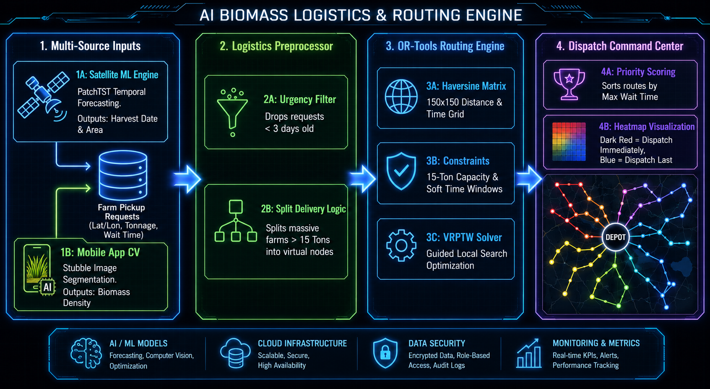

# AI Biomass Logistics & Routing Engine

The Operations Research & Logistics module forms the backbone of the biomass supply chain. Its goal is simple but incredibly complex to execute: safely dispatch a fleet of trucks to collect agricultural stubble from hundreds of farms before the farmers resort to burning it.

## Core Challenge

Farmers have a critically narrow **14-21 day window** between harvesting Kharif crops (rice) and sowing Rabi crops (wheat). Manual clearing takes too long, machinery is too expensive, so burning is the fastest zero-cost option. To stop this, our trucks must physically collect the biomass exactly when it is ready, operating within strict capacity limits and narrow time windows.

---

## Architectural Decisions & "The Why"

Building a routing engine for agriculture requires specific design choices compared to standard delivery logistics (like Amazon or FedEx). 

### 1. Urgency Filtering (The "Triage" approach)
> [!NOTE]
> **Decision:** We explicitly drop farm requests that are less than 3 days old from the daily routing batch.
> **Why:** If we try to route every single farm simultaneously, the algorithm will choke. By enforcing a 3-day aging minimum, we perform "triage"—focusing our limited trucks strictly on the farms closest to the burning-threshold, artificially shrinking the mathematical search space to guarantee faster solves.

### 2. Split Delivery Hack (Virtual Nodes)
> [!TIP]
> **Decision:** We automatically split farms with biomass payloads exceeding 15 tons into multiple smaller "virtual farms" at the exact same coordinates.
> **Why:** Standard VRP (Vehicle Routing Problem) solvers fail if a single node's demand is higher than the truck's maximum capacity. By splitting a 20-ton farm into a 15-ton "Part 1" and a 5-ton "Part 2", the solver seamlessly sends two different trucks to the same location on the same day.

### 3. Haversine Distance Grids
> [!NOTE]
> **Decision:** We calculate the graph distances using the Haversine formula and scale them into integers.
> **Why:** OR-Tools exact solvers require integer inputs to avoid floating-point math errors during matrix transformations. We also globally apply a 20-minute static loading time penalty to any arrival at a farm node to ensure realistic return-to-depot times.

### 4. Soft Time Windows
> [!IMPORTANT]
> **Decision:** We implemented "Soft" Time Windows instead of "Hard" limits. 
> **Why:** If a truck is stuck in traffic and misses a farm's requested time window by 5 minutes, a Hard limit will force the algorithm to entirely drop that farm from the route (meaning the farmer burns the field). With Soft Time Windows, the algorithm pays a massive mathematical penalty for being late, but *will still send the truck*.

### 5. Priority Heatmap Visualization
> [!TIP]
> **Decision:** Instead of random colors, we re-process the solver's output to assign colors based on urgency.
> **Why:** This turns a simple map into an **operational dispatch tool**. Fleet managers can instantly look at the map and deploy the "Dark Red" trucks first in the morning, knowing those routes contain the most high-risk farms.

---

## Final Implementation Pipeline

The backend was built entirely in Python, utilizing `pandas` for data manipulation, `folium` for interactive mapping, and Google's `ortools` for the algorithmic heavy lifting.

1.  **`01_mock_data_generator.py`**: Generates a synthetic but statistically realistic dataset of 100 farms centered around Ludhiana, Punjab, complete with randomized tonnage (5-35 tons) and urgency days.
2.  **`02_preprocessor.py`**: Executes the Urgency Triage (dropping recent harvests) and the Split Delivery Hack (creating PART1, PART2 nodes for massive farms).
3.  **`03_distance_matrix.py`**: Calculates the 150x150 integer Distance and Time matrices.
4.  **`04_vrptw_solver.py`**: Ingests the matrices and solves the CVRP-TW (Capacitated Vehicle Routing Problem with Time Windows) using Guided Local Search. Outputs the final manifest to JSON.
5.  **`05_visualize_routes.py`**: Reads the solved JSON, calculates the max wait-time per truck, sorts the fleet, and renders the dynamic, color-coded priority heatmap in HTML.
